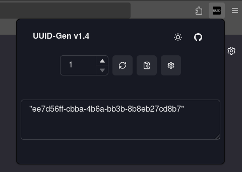
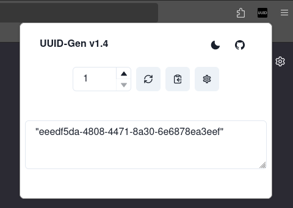
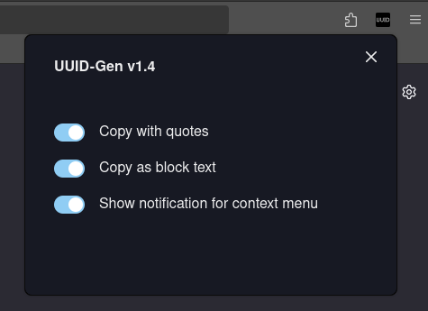
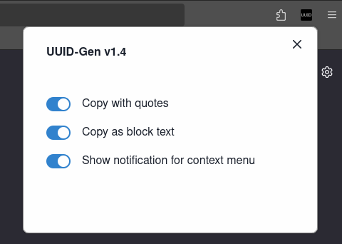

# Images

Note: It is difficult to get a screenshot of the context menu. When you right click, you will be shown an action button with the text "Generate Random UUID (Copied)"

_If you can get a screenshot of the context menu, it would be helpful if you can create a PR_ 🙏

## Application

## Settings

## Context Menu

